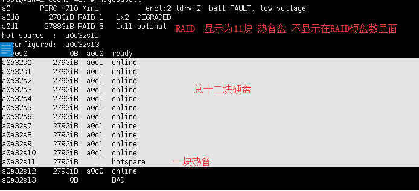

### 试用期规划


### 日常工作问题

| plugin.disk.check                         |      |      |
| :---------------------------------------- | ---- | ---- |
| plugin.krb.file                           |      |      |
| nginx超时                                 |      |      |
| http://videocenter.bokecc.com/servlet/eql |      |      |
| 回源404数量超过50                         |      |      |
| 商业用户........播放质量                  |      |      |
| 冷数据删除详情                            |      |      |
| plugin.raid.alive                         |      |      |
| 队列异常                                  |      |      |

| 机房               |       |
| ------------------ | ----- |
| 成都电信光华       | vdn33 |
| 沈阳联通机房       | vdn42 |
| 福州               | vdn34 |
| 呼市联通           | vdn44 |
| 舟山海宇道联通机房 | cc-h5 |
|                    |       |
|                    |       |


|      |      |      |
| ---- | ---- | ---- |
|      |      |      |
|      |      |      |
|      |      |      |


### openfalcon

('0 */1 * * *', 'falconweb.task.sync.ab_sync.main'), *

*('*/5 * * * *', 'falconweb.task.sync.vdn_count.main'), 

('0 */1 * * *', 'falconweb.task.sync.get_userid.insert_tb'),


### 用到的开源软件


| gluster       |      | 存储                       |
| ------------- | ---- | -------------------------- |
| mysqll        |      | 记录存储与其他关系信息     |
| tomcat        |      | 负责分发                   |
| nginx         |      | 提供视频下载               |
| cooper        |      | 负责调度和快速访问         |
| rsync         |      | 负责数据同步               |
| ubuntu        |      | 操作系统                   |
| cacti         |      | 宽带监控                   |
| falcon/nagios |      | 告警平台                   |
| saltstack     |      | 配置数据同步和服务器初始化 |

### 公司常用平台


| 视频,图片迁移平台              | http://admin.migratecenter.bokecc.com/                  |
| ------------------------------ | ------------------------------------------------------- |
| 视频信息机队列分发平台         | http://admin.videocenter.bokecc.comg                    |
| 平台展示及工作常用工具         | http://abext.bokecc.com/                                |
| 资产管理及权限管理平台         | http://azurebreeze.bokecc.com/                          |
| 播放调度管理平台               | http://mercurycover.vps.bokecc.com/                     |
| 直播管理平台                   | http://proton.csslcloud.net/                            |
| 日志统计带宽展示               | http://twinkle.bokecc.com/                              |
| 视频播放日志及运营数据统计展示 | http://analyse.bokecc.com/                              |
| wiki                           | http://192.168.1.185/wiki/                              |
| idc机房联系人                  | http://192.168.1.185/wiki/index.php/IDC:contact:list    |
| 值班检查平台                   | http://cacti.bokecc.com:5160/cooper/core_backup_vd.html |
| cc运维自动化平台               | http://aops.bokecc.com                                  |


### VDN节点上线添加存储


### 上班时间,报销及加班:

##### 考勤 

产品研发中心考勤与公司考勤保持一致，但整体往后移动30分钟（09:30~18:30)
新员工在试用期间考勤时间多增加1小时，转正后恢复正常
中午可以午休，午休时间不超过13:30
鼓励大家把更多时间投入到工作和学习中，公司为加班人员免费提供了加班餐及打车等福利
严禁在上班时间打游戏、闲聊，或者看与工作无关的视频及网页
考勤相关福利

##### 订餐规则

1. 正常工作日及周末提供加班餐，加班餐标准为不超过35元，超出标准部分以现金形式补给部门订餐人，不能从他人的标准里进行补充
2. 正常工作日加班餐提供统一预订，**\*晚7点开餐***，在公司用餐人员**\*不应早于晚9点***离开公司
3. 正常工作日加班餐每天16:30 接受订餐，截止到17:30，通过钉钉发送给订餐人
4. 最后一个订餐人员负责取餐
5. 如果所订餐发生变化（如无货），将直接换为价格类似的餐品
6. 正常工作日加班餐如果选择自己订餐，需提前通知订餐人，以便于统计
7. 自己订餐提供发票走正常报销流程，报销单需注明加班时间


如果当天加班，可以选择定加班餐
加班到晚10点离开公司，可以申请报销打车票
加班打车费报销要求实报实销，打车时间和打卡时间要吻合，不允许抵票
重要项目需要周末加班，可以在节假日申请调休（单次调休不超过2工作日）

##### 报销

通讯费,培训费,书费,交通费,住宿费,餐费+食品费(合计小于总额的30%),服装+维修服装(合计小于总额的20%),***停车费不可以***


|              |                                  |
| ------------ | -------------------------------- |
| 抬头         | 创盛视联数码科技（北京）有限公司 |
| 纳税人识别号 | 91110108666250065E               |
| 日常加班     | 150                              |
| 周末加班     | 400                              |
| 周末餐补     | 70                               |


### 常用命令

megasasctl


### 更换硬盘信息 对客服发送格式

```
资产编号：CC-Server-501,机柜号：17-E-11,服务器名称：[vdn42-stor-37.bokecc.com] ,服务码：J5T2J32,服务器IP：[218.60.53.37]	, 更换10号4T 硬盘（从0号开始计数），以上信息请以服务码为准。 
```


### 知识点

##### RAID显示数里不包括热备盘



##### axel下载参数

```
axel -a -n 5 -s 2048000 http://15.141.srcback.bokecc.com/63435409.2.flv -o /GlusterFS/storage.bokecc.com/d1/flvs/4DD209FD83B91A61/2018-08-14/4EA4A2C24FA0B90A9C33DC5901307461-2.flv
```


